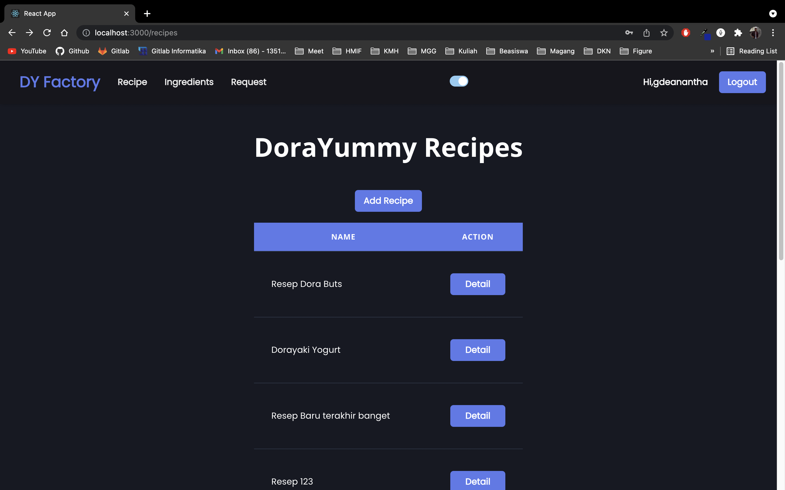
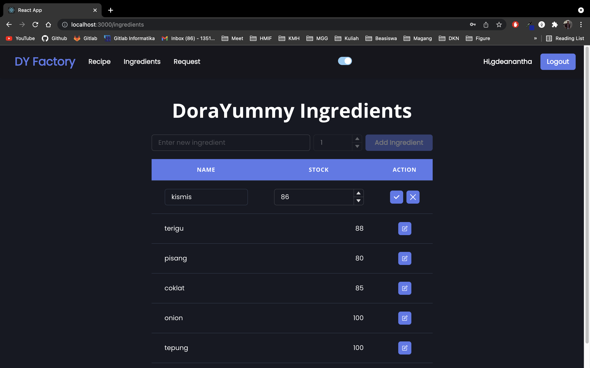
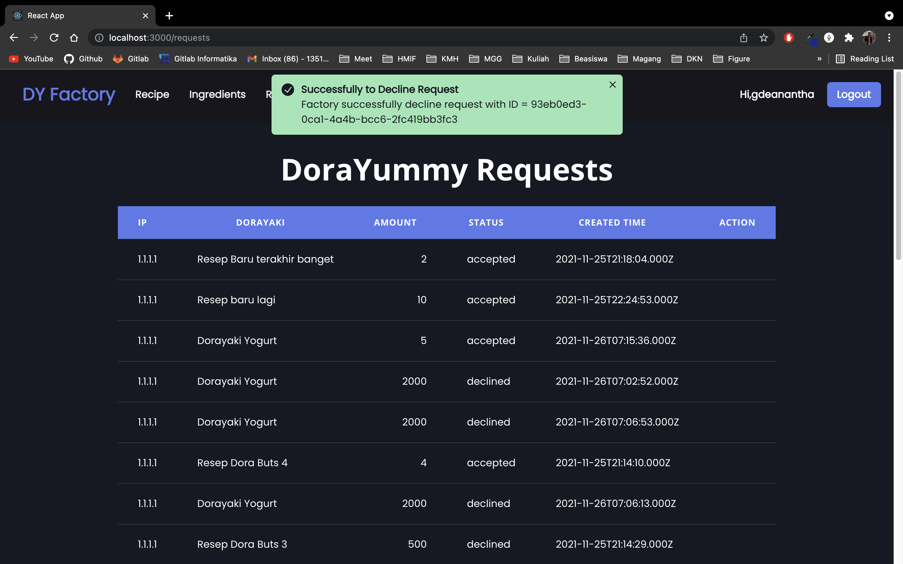

# Dorayaki-Factory-Client
## Semester I Tahun 2021/2022 
### Tugas Besar II IF3110 Milestone 2 Pengembangan Aplikasi Berbasis Web

*Program Studi Teknik Informatika* <br />
*Sekolah Teknik Elektro dan Informatika* <br />
*Institut Teknologi Bandung* <br />

*Semester I Tahun 2021/2022*

## Deskripsi
Dorayaki-Factory-Client merupakan Web App berbasis React yang menyediakan layanan frontend untuk pabrik dorayaki. Dorayaki-Factory-Client dibangun dengan development server create-react-app.

## Fungsional Aplikasi
1. Melakukan registrasi dan login user
2. Mengelola bahan baku pabrik
3. Mengelola resep dorayaki
4. Mengelola request penambahan stok

## Author
1. Gde Anantha Priharsena (13519026)
2. Reihan Andhika Putra (13519043)
3. Reyhan Emyr Arrosyid (13519167)

## Requirements
- [ReactJS](https://reactjs.org/docs/getting-started.html)

## Cara menjalankan
1. Download dan install semua requirement yang dibutuhkan
2. Clone repository ini
3. Ketikkan command 
```
npm install
npm start
```

## Screenshot
### Autentikasi


### Halaman Utama


### Resep di Pabrik



### Bahan Baku di Pabrik


### Daftar Request




### Pembagian Tugas
1. Frontend Pabrik Halaman Login : 13519026
2. Frontend Pabrik Halaman Register : 13519026
3. Frontend Pabrik Halaman Utama : 13519026
4. Frontend Pabrik Halaman Resep : 13519026
5. Frontend Pabrik Halaman Bahan Baku : 13519167
6. Frontend Pabrik Halaman Request : 13519026